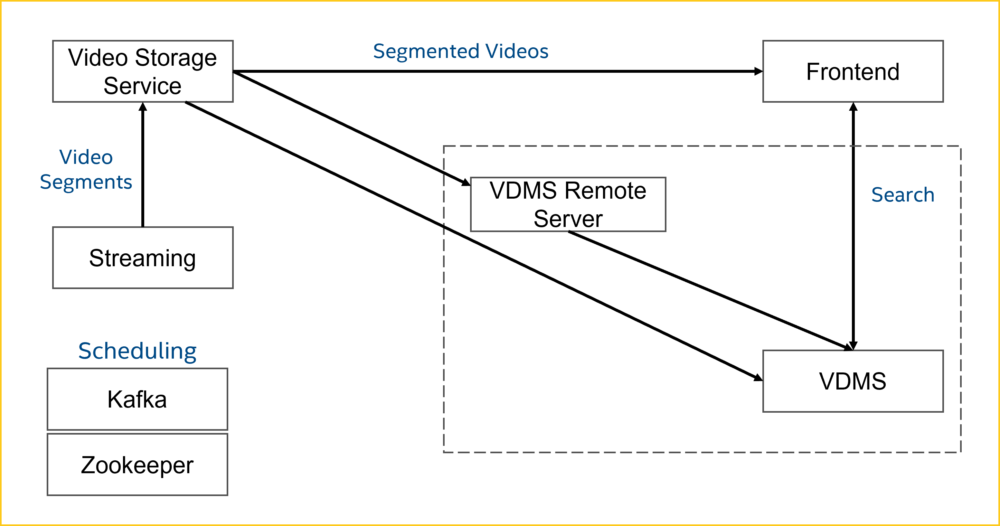
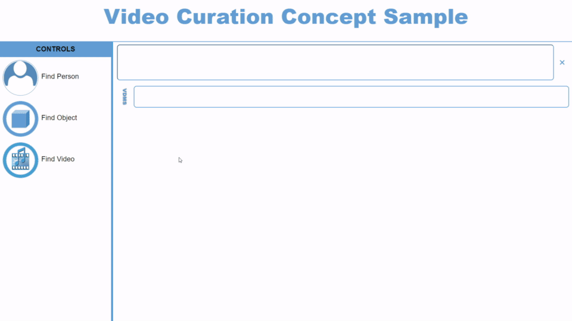

[](https://scorecard.dev/viewer/?uri=github.com/IntelLabs/Video-Curation-Sample)

This sample implements libraries of video files content analysis, database ingestion, content search and visualization:
- **Ingest**: Analyze video content and ingest the data into the VDMS.
- **VDMS**: Store metadata efficiently in a graph-based database.
- **Visualization**: Visualize content search based on video metadata.



**This is a concept sample in active development.**
<br>

## Software Stacks

The sample is powered by the following Open Visual Cloud software stacks:
- **NGINX Web Service**:
  - [The NGINX/FFmpeg-based web serving stack](/deployment/Dockerfiles/Xeon/ubuntu-22.04/media/nginx) is used to store and segment video content and serve web services. The software stack is optimized for Intel Xeon Scalable Processors.
<br>

### License Obligations

- FFmpeg is an open source project licensed under LGPL and GPL. See https://www.ffmpeg.org/legal.html. You are solely responsible for determining if your use of FFmpeg requires any additional licenses. Intel is not responsible for obtaining any such licenses, nor liable for any licensing fees due, in connection with your use of FFmpeg.
<br>


## Install Prerequisites:

- **Time Zone**: Check that the timezone setting of your host machine is correctly configured. Timezone is used during build. If you plan to run the sample on a cluster of machines managed by Docker Swarm or Kubernetes, please make sure to synchronize time among the manager/master node and worker nodes.

- **Build Tools**: Install ```cmake``` and ```m4``` if they are not available on your system.

- **Docker Engine**:
  - Install [docker engine](https://docs.docker.com/install) and verify you have Docker Compose V2 2.18.0+ setup.
  - Setup [docker swarm](https://docs.docker.com/engine/swarm), if you plan to deploy through docker swarm. See [Docker Swarm Setup](deployment/docker-swarm/README.md) for additional setup details.
  <!-- - Setup [Kubernetes](https://kubernetes.io/docs/setup), if you plan to deploy through Kubernetes. See [Kubernetes Setup](deployment/kubernetes/README.md) for additional setup details. -->
  - Setup docker proxy as follows if you are behind a firewall:
    ```bash
    sudo mkdir -p /etc/systemd/system/docker.service.d
    printf "[Service]\nEnvironment=\"HTTPS_PROXY=$https_proxy\" \"NO_PROXY=$no_proxy\"\n" | sudo tee /etc/systemd/system/docker.service.d/proxy.conf
    sudo systemctl daemon-reload
    sudo systemctl restart docker
    ```
<br>


## Build Streaming Sample:

```bash
mkdir build
cd build
cmake -DIN_SOURCE=stream ..
make
```

See also [Customize Build Process](doc/cmake.md) for additional options.
<br>

## Start/Stop Sample:

Use the following commands to start/stop services via docker-compose:

```bash
make start_docker_compose
make stop_docker_compose
```

Use the following commands to start/stop services via docker swarm:

```bash
make update # optional for private registry
make start_docker_swarm
make stop_docker_swarm
```
See also:  [Docker Swarm Setup](deployment/docker-swarm/README.md).
<br>

<!-- Use the following commands to start/stop Kubernetes services:

```bash
make update # optional for private registry
make start_kubernetes
make stop_kubernetes
```

See also: [Kubernetes Setup](deployment/kubernetes/README.md). -->
<br>

### Start/Stop Scripts:
Instead of running the start/stop commands individually (as shown above), we have provided scripts to help with the deployment.

The [start_app.sh](/start_app.sh) script provides everything you need to deploy the application.

Run application using videos and GPU:
```bash
./start_app.sh -e GPU -s videos
```
This same script can be used to run application with CPU, streaming capability, etc.
The accepted parameters for the start script are below:<br>

| Parameter          | Type     | Description                                                     | Default       |
| :----------------- | :------: | :-------------------------------------------------------------- | :-----------: |
| -h                 | optional | Print this help message                                         |               |
| -d or --debug      | optional | Flag for debugging                                              | "0"           |
| -e or --device     | optional | Device to use for inference                                     | CPU           |
| -i or --ingestion  | optional | Ingestion type (object, face)                                   | "object,face" |
| -l or --tars       | optional | Flag to load docker images instead of building from Dockerfiles | "0"           |
| -n or --ncurations | optional | Number of ingestion containers                                  | 1             |
| -r or --registry   | optional | Registry                                                        | None          |
| -s or --source     | optional | Input source type (videos, stream)                              | stream        |
| -t or --type       | optional | Deployment method (compose, k8)                                 | compose       |
| -v or --nstreams   | optional | Number of video streams                                         | 1             |
<br>

The [stop_app.sh](/stop_app.sh) script is provided to stop the application from a different terminal. To stop and prune the docker images, run:
```bash
./stop_app.sh -p
```

If you only want to stop the docker containers without running `docker builder prune`, remove `-p`.
<br>


## Launch Sample UI:

Launch your browser and browse to ```https://<hostname>:30007```. The sample UI is similar to the following:

</IMG>

<!-- * For Kubernetes/Docker Swarm, ```<hostname>``` is the hostname of the manager/master node. -->
* For Docker Swarm, ```<hostname>``` is the hostname of the manager/master node.
* If you see a browser warning of self-signed certificate, please accept it to proceed to the sample UI.

---

## See Also

- [Configuration Options](doc/cmake.md)
- [Docker Swarm Setup](deployment/docker-swarm/README.md)
<!-- - [Kubernetes Setup](deployment/kubernetes/README.md) -->
- [Sample Distribution](doc/dist.md)
- [Visual Data Management System](https://github.com/intellabs/vdms)
