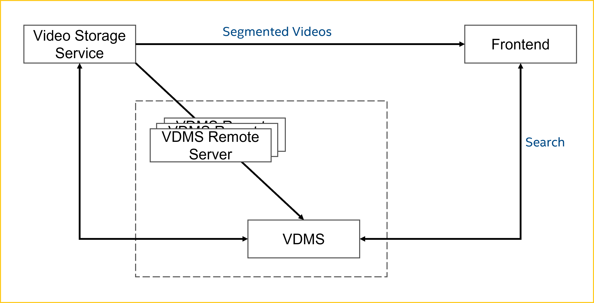
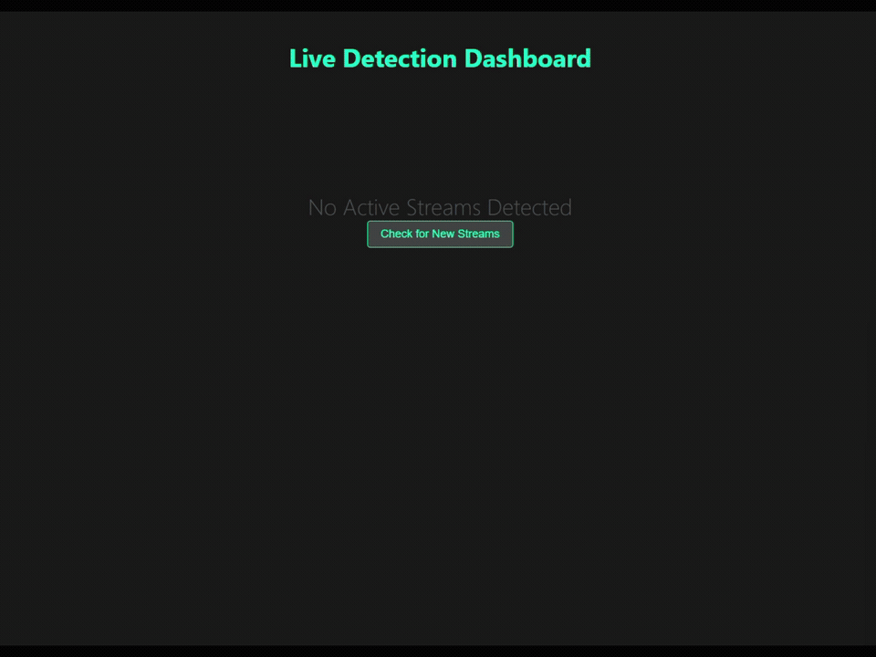

[](https://scorecard.dev/viewer/?uri=github.com/IntelLabs/Video-Curation-Sample)

This sample implements libraries for video content analysis, database ingestion, content search and visualization:
- **Ingest**: Analyze video content and ingest the data into the VDMS.
- **VDMS**: Store metadata efficiently in a graph-based database.
- **Visualization**: Visualize content search based on video metadata.



**This is a concept sample in active development.**
<br>


## Software Stacks
This sample is powered by the following software stacks:
- **NGINX Web Service**:
  - [The NGINX/FFmpeg-based web serving stack](/deployment/Dockerfiles/Xeon/ubuntu-22.04/media/nginx) is used to store and segment video content and serve web services. The software stack is optimized for Intel Xeon Scalable Processors.
<br>

### License Obligations
- FFmpeg is an open source project licensed under LGPL and GPL. See https://www.ffmpeg.org/legal.html. You are solely responsible for determining if your use of FFmpeg requires any additional licenses. Intel is not responsible for obtaining any such licenses, nor liable for any licensing fees due, in connection with your use of FFmpeg.
<br>


## Install Prerequisites:

- **Time Zone**: Check that the timezone setting of your host machine is correctly configured. Timezone is used during build.
<!-- If you plan to run the sample on a cluster of machines managed by Docker Swarm or Kubernetes, please make sure to synchronize time among the manager/master node and worker nodes. -->

- **Build Tools**: Install ```cmake``` and ```m4``` if they are not available on your system.

- **Docker Engine**:
  - Install [docker engine](https://docs.docker.com/install) and verify you have Docker Compose V2 2.18.0+ setup.
  <!-- - Setup [docker swarm](https://docs.docker.com/engine/swarm), if you plan to deploy through docker swarm. See [Docker Swarm Setup](deployment/docker-swarm/README.md) for additional setup details. -->
  <!-- - Setup [Kubernetes](https://kubernetes.io/docs/setup), if you plan to deploy through Kubernetes. See [Kubernetes Setup](deployment/kubernetes/README.md) for additional setup details. -->
  - Setup docker proxy as follows if you are behind a firewall:
    ```bash
    sudo mkdir -p /etc/systemd/system/docker.service.d
    printf "[Service]\nEnvironment=\"HTTPS_PROXY=$https_proxy\" \"NO_PROXY=$no_proxy\"\n" | sudo tee /etc/systemd/system/docker.service.d/proxy.conf
    sudo systemctl daemon-reload
    sudo systemctl restart docker
    ```
<br>


## Prepare Videos and/or Camera Configurations
This application processes videos and camera streams by watching the `inputs` directory.
MP4 videos should be placed in this directory and the application will automatically begin processing it.  If interested in using sample videos, see [examples](/doc/cmake.md#examples).

To configure the application for camera streams, add the camera name and URL to `inputs/camera_config.yaml`.
The YAML file provides a sample entry.
<br>


## Start/Stop Service using Scripts:
We have provided scripts to help with the deployment.
The [start_app.sh](/start_app.sh) script provides everything you need to deploy the service.
To run the service using GPU, use:
```bash
./start_app.sh -e GPU
```
This same script can be used to run the service with CPU, resizing video to 640x640, etc.
The accepted parameters for the start script are below:<br>

| Parameter          | Type     | Description                                                                                    | Default       |
| :----------------- | :------: | :--------------------------------------------------------------------------------------------- | :-----------: |
| -h                 | optional | Print this help message                                                                        |               |
| -d or --debug      | optional | Flag for debugging                                                                             | "0"           |
| -e or --device     | optional | Device to use for inference                                                                    | CPU           |
| -i or --ingestion  | optional | Ingestion type (object, face)                                                                  | "object,face" |
| -l or --tars       | optional | Flag to load docker images instead of building from Dockerfiles                                | "0"           |
| -m or --model      | optional | Custom YOLO model name (<model name>.pt). If not provided model YOLO11n is used.               |               |
| -o or --omit-det   | optional | By default, object detections are printed. To omit printing detections to screen, enable flag. | False         |
| -z or --resize     | optional | Flag to resize video to model input size (640x640)                                             | False         |
<br>
See also [Customize Build Process](doc/cmake.md) for additional information on options.


The [stop_app.sh](/stop_app.sh) script is provided to stop the service from a different terminal. To stop and prune the docker images (data doesn't persist), run:
```bash
./stop_app.sh -p
```

**NOTE:** Remove `-p` if you only want to stop the docker containers without pruning docker builder, containers, volumes, and networks.
<br>


## Manually Build Streaming Sample:
Instead of running the start/stop using the above scripts, you can run the commands individually as shown below.

```bash
mkdir build
cd build
cmake ..
make
```
See also [Customize Build Process](doc/cmake.md) for additional options.
<br>

### Start/Stop Sample:

Use the following commands to start/stop services via docker-compose:

```bash
make start_docker_compose
make stop_docker_compose
```
<!--
Use the following commands to start/stop services via docker swarm:
```bash
make update # optional for private registry
make start_docker_swarm
make stop_docker_swarm
```
See also:  [Docker Swarm Setup](deployment/docker-swarm/README.md). -->
<!-- <br> -->

<!-- Use the following commands to start/stop Kubernetes services:
```bash
make update # optional for private registry
make start_kubernetes
make stop_kubernetes
```
See also: [Kubernetes Setup](deployment/kubernetes/README.md). -->
<br>


## Display Object Detected
Once the application is started, we have provided a script to display the detections with associated timestamps.
To use the script, be sure ***NOT*** to use flags `-o` or `--omit-det` so the detection details are available.
To display this information, in a separate terminal, run `display_detections.sh` with the objects of interest.
For example, to display when "person" and "car" objects are detected, run:
```bash
./display_detections.sh person,car
```
<br>


## Launch Sample UI:
Launch your browser and browse to ```https://<hostname>:30007```. The sample UI is similar to the following:

</IMG>

<!-- * For Kubernetes/Docker Swarm, ```<hostname>``` is the hostname of the manager/master node. -->
<!-- * For Docker Swarm, ```<hostname>``` is the hostname of the manager/master node. -->
* If you see a browser warning of self-signed certificate, please accept it to proceed to the sample UI.
<br>


## Redeploy Service by Persisting Data
There may be cases where you want to stop the service but redeploy later with data persisted.  In such cases, follow the following steps, assuming service is currently running, i.e. via `./start_app.sh -e CPU -z -d`:

1. [Optional] For redeployment, we will save the state of the named volumes. To conserve space in the `lcc_vdms-content` volume, it may be beneficial to delete the `/mnt/tmp` directory, this is done by running:
    ```bash
    docker exec -it lcc_vdms-service_1 rm -rf /mnt/tmp
    ```
    <br>

1. Save docker images for running service:
    ```bash
    ./deployment/DockerImageTars/save_docker_images.sh -e CPU -z
    ```
    <br>

    The options used should be the same as those used for running the original service, if available.
    The accepted parameters for `save_docker_images.sh` are below:<br>

    | Parameter          | Type     | Description                                        | Default       |
    | :----------------- | :------: | :------------------------------------------------- | :-----------: |
    | -h                 | optional | Print this help message                            |               |
    | -e or --device     | optional | Device to use for inference                        | CPU           |
    | -z or --resize     | optional | Flag to resize video to model input size (640x640) | False         |
    <br>

1. Stop the running service:
    ```bash
    ./stop_app.sh
    ```
    The stop script stops the service, removes all stopped Docker containers and removes all unused Docker networks.
    We ***DO NOT*** use the `-p` flag here to avoid removing the volumes before backing them up.
    <br>

1. Backup the docker volumes to redeploy later. First rename the `lcc_app-content` volume and remove original:
    ```bash
    ./deployment/DockerImageTars/rename_volume.sh lcc_app-content lcc_app-content_saved

    docker volume rm lcc_app-content
    ```

    The `lcc_vdms-content` volume is sparse, so to backup, compress the volume to respective location. In this case, we save the file to `deployment/DockerImageTars/resize` and remove original:
    ```bash
    docker run --rm -v lcc_vdms-content:/data \
      -v ${PWD}/deployment/DockerImageTars/resize:/backup \
      ubuntu bash -c "tar czSf /backup/lcc_vdms-content_saved.tar.gz /data"

    docker volume rm lcc_vdms-content
    ```
    NOTE: Check the size of the volume using `docker system df -v`.
    <br>

1. At this point, images and volumes are saved. You can safely, prune all docker images/volumes if needed via `./stop_app.sh -p`.

1. Prior to redeployment, videos already inserted in previous deployment of service or videos which should not be processed (if any) should be removed from `inputs/`, and any camera configurations should be updated for next deployment.

1. Repopulate the docker volumes to expected name. For `lcc_app-content_saved`, we can simply rename it:
    ```bash
    ./deployment/DockerImageTars/rename_volume.sh lcc_app-content_saved lcc_app-content

    docker volume rm lcc_app-content_saved
    ```

    The `lcc_vdms-content` volume should be created and populated with compressed data from previous step:
    ```bash
    docker volume create lcc_vdms-content

    docker run --rm -v lcc_vdms-content:/data \
      -v ${PWD}/deployment/DockerImageTars/resize:/backup \
      ubuntu bash -c "tar -xvzf /backup/lcc_vdms-content_saved.tar.gz"
    ```
    <br>

1. Restart the service with appropriate options but include `--tars` to use saved images.  Here, we're re-deploying using the same flags as the original deployment.
    ```bash
    ./start_app.sh -e CPU -z -d --tars
    ```
  <br>

---

## See Also

- [Configuration Options](doc/cmake.md)
<!-- - [Docker Swarm Setup](deployment/docker-swarm/README.md) -->
<!-- - [Kubernetes Setup](deployment/kubernetes/README.md) -->
<!-- - [Sample Distribution](doc/dist.md) -->
- [Visual Data Management System](https://github.com/intellabs/vdms)
