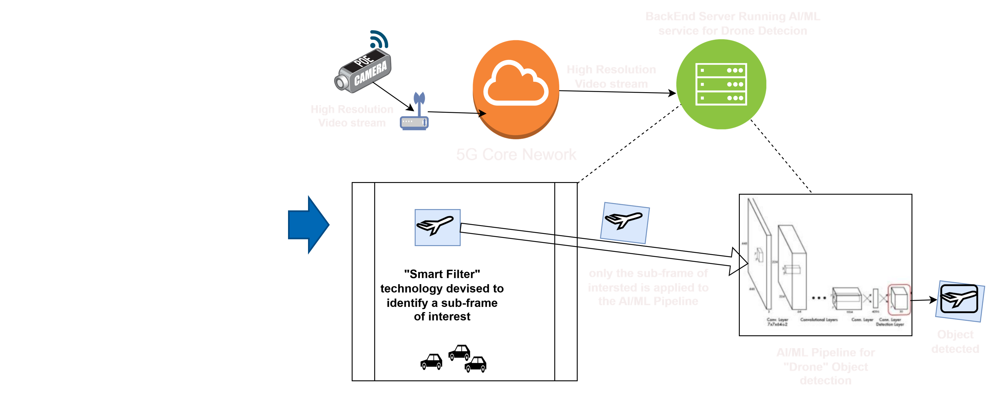
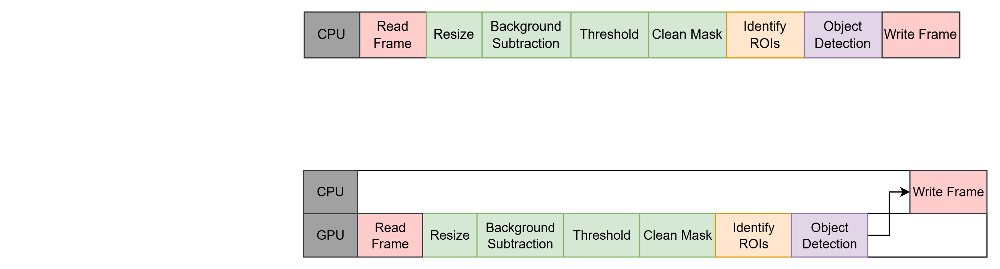

# High Resolution Object Detection Pipeline (WIP)

This pipeline focuses on real-time processing of high-resolution (8K) video for object detection.
Currently, real-time processing of high-resolution (HR) frames is not possible as large compute power is needed which are typically beyond any HW capabilities.
There are techniques such as image tiling or resolution reduction, but these workarounds compromisr detail integrity, diminish inference throughput, and can make rendering real-time processing of HR feeds infeasible within HW boundaries.
HR video streams typically achieve higher accuracy in object detection, therefore, a technique to reduce compute on HR videos is needed.

To solve this issue, we created a Smart Filtering Pipeline to significantly reduce pixel processing (compute) by *automatically* identifying the regions of interest (ROIs) which is then forwarded to the detection model.

<center></center>
<center>High-level High Resolution Object Detection Pipeline</center>
<br>


## Smart Filtering Pipeline
The Smart Filtering (SF) is a portion of the pipeline which filters HR videos for ROIs which are used in the detection phase instead of processing the entire frame.
This helps reduce the compute while maintaining detection accuracy.
In smart filtering, we use motion to help identify ROIs, which is ideal for surviellence and applications such as the test use-case, drone detection, with stationary cameras.
Keep in mind, if camera is NOT stationary, some background movement may be captured as foreground objects due to background subtraction algorithm.

<center></center>
<center>Flow of Smart Filtering Pipeline</center>
<br>

The current filtering pipeline includes the following steps:
1. **Resize:** Resize full resolution (HR) frame to smaller size for less computation.
1. **Background Subtraction:** Use resized image to obtain mask of foreground objects using background subtraction.  With background subtraction, there is an option to include the masks of previous frames which is enabled by default for 3 previous frames.
1. **Threshold:** Apply thresholding to mask generated by previous step
1. **Clean Mask:** Dilate the thresholded frame for easier detection of ROIs.
1. **Identify Region of Interests (ROIs):** Retrieve contours from dilated mask
    1. Filter contours by defined minimum contour area and obtain ROIs in full resolution coordinates.
    1. Sort ROIs by area (largest to smallest)
    1. Merge ROIs until merged ROIs are up to a size limit
    1. Filter ROIs and remove smaller ROIs that are 90% contained within other ROIs
1. **Detection:** Use identified ROIs in object detection

***NOTE:*** If the video resolution is less than 2K (1920x1080), Smart Filtering is disabled as most systems can support this resolution in real-time.


### Testing
The current implementation of the Smart Filtering pipeline is optimized for the test use-case, drone detection.
Drones are typically small in the video frames so if your use-case of interest has different objects, it may be beneficial to test the pipeline results on an existing test video for your use-case.

For this case, we provide [`test_detections.py`](/fastapi/tests/test_detections.py) which annotates ROIs identified by the Smart Filtering pipeline onto each frame of the video for visual inspection.

For testing purposes, you can use VSCode DevContainer (easiest method) or manually deploy the fastapi dockerfile. Using VSCode is straight forward, so here, we will manually deploy the fastapi Dockerfile as it contains the same setup used in the application AND start the test script.
Here we will build the container, if not available:
```bash
REPO_DIR=`pwd`

# Build container
cd ${REPO_DIR}/fastapi

docker build --network host \
--build-arg USER=$(whoami) --build-arg GROUP="$(id -gn)" \
--build-arg UID=$(id -u) --build-arg GID=$(id -g) \
--build-arg DEVICE=GPU --build-arg DEBUG=1 \
--build-arg IN_SOURCE=videos --build-arg RESIZE_FLAG=False \
-f Dockerfile -t lcc_fastapi:stream .
```


The script for testing the pipeline is in `fastapi/tests/` and your test video is expected to be in `inputs/` (i.e. `anduril_swarm_8K.mp4`) which is mounted to `/watch_dir` within container.

Please see [Detection](#detections-using-sf-and-fine-tuned-yolo-model) section for expected location of models and see [Test Pipeline: Smart Filtering](#test-pipeline) for more information on testing the filtering pipeline.

>***NOTE:*** The default video is an open-source video of a swarm of drones.
This video can be downloaded from [yolov11-UAV-finetune](https://github.com/droneforge/yolov11-UAV-finetune/blob/main/anduril_swarm.mp4).
Our work is NOT affiliated with this source.
Since this work focuses on HR videos, we converted the test video to 8K using the following ffmpeg command:
`ffmpeg -i anduril_swarm.mp4 -vf "scale=7680:4320:flags=lanczos" -c:v libx265 -crf 20 -preset medium -c:a copy anduril_swarm_8K.mp4`
<br>


To deploy this test, run the following command but modify the name of the test_video.
The results from the test will be saved in `fastapi/tests/test_detections_results/drone_detection/<test_video>`.
```bash
docker run --rm --ipc=host \
--gpus all --env NVIDIA_DRIVER_CAPABILITIES=all \
--name test_detections \
--env ENABLE_VDMS=False \
--env USER=$(whoami) --env GROUP="$(id -gn)" \
--env UID=$(id -u) --env GID=$(id -g) \
--env DEVICE=GPU --env DEBUG=1 \
--env IN_SOURCE=videos --env RESIZE_FLAG=False \
-v ${REPO_DIR}/inputs:/watch_dir \
-v ${REPO_DIR}/fastapi/resources:/home/resources \
-v ${REPO_DIR}/fastapi/tests:/home/tests \
-v ${REPO_DIR}/fastapi/tests/nginx.conf:/etc/nginx/nginx.conf \
lcc_fastapi:stream /bin/bash -c "python /home/tests/test_detections.py --source <test_video>.mp4 --type motion"
```


If you are not satisfied with the results, feel free to modify/optimize the pipeline further by overriding any pre-defined methods.
The following command starts the detached container.
```bash
docker run -d --rm --ipc=host \
--gpus all --env NVIDIA_DRIVER_CAPABILITIES=all \
--name test_detections \
--env ENABLE_VDMS=False \
--env USER=$(whoami) --env GROUP="$(id -gn)" \
--env UID=$(id -u) --env GID=$(id -g) \
--env DEVICE=GPU --env DEBUG=1 \
--env IN_SOURCE=videos --env RESIZE_FLAG=False \
-v ${REPO_DIR}/inputs:/watch_dir \
-v ${REPO_DIR}/fastapi/resources:/home/resources \
-v ${REPO_DIR}/fastapi/tests:/home/tests \
-v ${REPO_DIR}/fastapi/tests/nginx.conf:/etc/nginx/nginx.conf \
-v ${REPO_DIR}/fastapi/.vscode:/home/.vscode \
lcc_fastapi:stream tail -f /dev/null
```

You can attach to the container to debug the filtering as needed.

For testing other components, please see [Testing Pipeline Components](#testing-pipeline-components) section.
<br>


#### VSCode
If using VSCode, the provided `.vscode` directory is already mounted in the above command which includes `launch.json` for debugging.
You can use the provided DevContainer or use the docker extension to connect to the `lcc_fastapi:stream` container by clicking `Attach Visual Studio Code`.
Once connected, it will install VSCode in the container.
If you receive an error regarding permissions during installation, you must modify the remote user.
To allow permission for the installation, open the `Command Pallette` and select `Dev Containers: Open Attached Container Configuration File`.
Edit the file as follows:
```json
{
	"workspaceFolder": "/home",
	"extensions": [
		"ms-python.debugpy",
		"ms-python.python",
		"ms-python.vscode-pylance",
		"ms-python.vscode-python-envs"
	],
    "remoteUser": "${localEnv:USER}",
    "containerEnv": {
        "LOCAL_UID": "${localEnv:UID}"
    }
}
```
<br>

### Optimization Areas

For the smart filtering pipeline, the following are potential areas for optimizations.

| Category               | Variable                             | Default     | Description |
| ---------------------- | ------------------------------------ | ----------- |------------ |
| Smart Filtering        | SMART_FILTERING_PIXEL_CONSTRAINT     | 1920 * 1080 | Smart filtering is enabled if vidoe is larger than 2K. YOLO models typicaly can efficiently process lower resolution without overloading resources.  |
| Background Subtraction | BKGD_SUB_INCLUDE_HISTORY             | True        | Include temporal history with mask generation. True: dilate masks in history and combine into single current mask via `method`. The final background model mask is generated using the union of combined mask (if true) and current background mask. |
| Background Subtraction | BKGD_SUB_INCLUDE_HISTORY_DILATE_KERNEL_SIZE | 15 x 15 | Kernel used to dilate temporal masks if `BKGD_SUB_INCLUDE_HISTORY` is True. |
| Background Subtraction | BKGD_SUB_INCLUDE_HISTORY_METHOD      | or          | Method used to combine mask history. Specify `and` or `or`. |
| Background Subtraction | BKGD_SUB_INCLUDE_HISTORY_TEMPORAL_SIZE | 3         | Number of previous masks to maintain for temporal mask generation. |
| Background Subtraction | BKGD_SUB_MOG2_DETECTSHADOWS          | False       | A boolean to enable/disable shadow detection.  |
| Background Subtraction | BKGD_SUB_MOG2_HISTORY                | 2 * TARGET_FPS | The number of previous frames used to build the background model. Higher value: More stable background. It is less likely to be "fooled" by a tree swaying slightly, but it takes much longer for a newly stopped object (like a parked car) to become part of the background. Lower value: The model adapts very quickly. Useful for rapidly changing lighting, but may cause moving objects to "disappear" into the background if they move slowly. |
| Background Subtraction | BKGD_SUB_MOG2_LR                     | 1 / BKGD_SUB_MOG2_HISTORY | Learning rate to use for background model |
| Background Subtraction | BKGD_SUB_MOG2_VARTHRESHOLD           | 10          | The Mahalanobis distance threshold to decide whether a pixel is foreground or background. Higher value (Lower sensitivity): This reduces "salt and pepper" noise and ignores small fluctuations, but you might lose the edges of your actual objects (making bounding boxes smaller/fragmented). Lower value (Higher sensitivity): You’ll catch every tiny movement, but you’ll get a lot of noise from compression artifacts or camera sensor grain. |
| Threshold              | THRESHOLD_VALUE                      | 127         | The threshold value used to classify pixel intensities. |
| Clean Mask             | DILATE_KERNEL_SIZE                   | 5 x 5       | Kernel used to dilate mask AFTER thresholding is performed. |
| Identify ROIs          | ROI_BB_FULL_RES_PADDING              | MODEL_W * .02 | Padding to add to ROIs to make sure detection captures full box. |
| Identify ROIs          | ROI_CONTAINMENT_THRESH               | 0.95         | Input argument to filter_contained_boxes used for removing smaller contained ROIs. Current value is 0.9 (90%). |
| Identify ROIs          | ROI_DISTANCE_THRESH_RATIO            | 0.05        | Input argument to merge ROIs is distance less than this parameter. |
| Identify ROIs          | ROI_MAX_RELATIVE_SIZE_RATIO          | 1.0         | Ratio of frame width/height to limit ROIs. Currently accepts ROI if width/height less than frame size. |
| Identify ROIs          | ROI_MERGE_SIZE_LIMIT                 | MODEL_W * 2 | The max width/height of merged ROIs. Value is equivalent as MODEL_W (expected imgsz for model.predict) |
| Identify ROIs          | ROI_MIN_AREA_RATIO                   | 0.01        | Minimum area ratio of pixels for objects/motion. This value is in terms of pixels in resized image.  Currently value is set to 41 pixels (1% of width x 1% of height). |
<br>

Once satisfied with annotated results, you can proceed with running the full pipeline.
***NOTE:*** If you modified any methods within the test script, be sure to update the predefined code to use your changes in the pipeline.
<br>


## Detections using SF and Fine-Tuned YOLO Model

This guide assumes a YOLO model or fine-tuned YOLO model is available for detection.

Place your model in the appropriate directory for the application.

| Directory                                            | Description |
| ---------------------------------------------------- | ----------- |
| `fastapi/resources/models/ultralytics/custom_models` | Place custom models in this directory. Each model file should have a unique name which will be used to deploy (and/or export) the model via the application start script. The PT model (`${UNIQUE_MODEL_NAME}.pt`) is exported to OpenVINO (`${UNIQUE_MODEL_NAME}_openvino_model/`) or TensorRT (`${UNIQUE_MODEL_NAME}.engine`), dependent on device used.  |
| `fastapi/resources/models/ultralytics/${MODEL_NAME}/FP16` | Ultralytics YOLO models are typically placed in this directory where MODEL_NAME is the short name for the model (i.e. `yolo11n`). The PT model (`${MODEL_NAME}.pt`) is exported to OpenVINO (`${MODEL_NAME}_openvino_model/`) or TensorRT (`${MODEL_NAME}.engine`), dependent on device used. |

Please note the model labels are retrieved from the model directly, so the model must contain these details.
<br>


## Testing Pipeline Components
We provided multiple test scripts to test different components of the pipeline.
Each of the tests can be run as specified in the [Smart Filtering Pipeline: Testing](#testing) section using the same video `anduril_swarm_8K.mp4` as `SOURCE`.
Here we provide details on each available test.

| Component | Test File | Description |
| --------- | --------- | ----------- |
| Detection Model | [test_model.py](/fastapi/tests/test_model.py) | Test the model for both CPU and GPU on provided RTSP URL or video file |
| Smart Filtering | [test_detections.py](/fastapi/tests/test_detections.py) | This test independently evaluates the detection pipeline (with and without Smart Filtering) only and does not include video clip generation or sending metadata to database for querying. |
| Stream Reader | [test_pipeline.py](/fastapi/tests/test_pipeline.py) | Scenario 1 tests the behavior of Readers when provided an invalid RTSP url.<br>Scenario 2 reads the RTSP url or video file for a specified duration or until it ends. |
| Video Clip Generation | [test_pipeline.py](/fastapi/tests/test_pipeline.py) | Scenario 3 mimics the clip generation within the pipeline. |
| Smart Filtering | [test_pipeline.py](/fastapi/tests/test_pipeline.py) | Scenario 4 tests the entire pipeline and saves output video of results. |


### Test Models
This test reads the `SOURCE` from `./inputs` (the local directory or `/watch_dir` if in container), or RTSP server, and creates a video with overlaid detection results for both GPU and CPU model.
```bash
python test_models.py -s "${SOURCE}"
```

You can also use the Yolo11n model by using:
```bash
python test_models.py -s "${SOURCE}" -m yolo11n --no-custom
```

The arguments available for this test are as follows:
| Argument | Default | Description |
| -------- | ------- | ----------- |
| -s SOURCE,<br>--source SOURCE | anduril_swarm_8K.mp4 | Video filename (located in /inputs) or RTSP target stream endpoint |
| --no-custom | - | Enable if using Ultralytics YOLO model |
| -m MODEL_NAME,<br>--model MODEL_NAME | drone_detection | Name of model. Required if `--no-custom` is enabled. |
| --type {object,motion} | None | Filter by detection type (object or motion) |
| --device {cpu,gpu} | None | Filter by device (cpu or gpu) |
<br>


### Test Detections
This test reads the `SOURCE` from `./inputs`, and evaluates the detection pipeline only.

To run the detection test, use the following:
```bash
python test_detections.py --source "${SOURCE}"
```

You also have control on which scenario, model, etc. to use during testinh.
The arguments available are as follows:
| Argument | Default | Description |
| -------- | ------- | ----------- |
| -s SOURCE,<br>--source SOURCE | anduril_swarm_8K.mp4 | Video filename (located in ./inputs) |
| --no-custom | - | Enable if using Ultralytics YOLO model |
| -m MODEL_NAME,<br>--model MODEL_NAME | drone_detection | Name of model. Required if `--no-custom` is enabled. |
| --type {object,motion} | None | Filter by detection type (object or motion). "motion" shows the ROI while "object" shows detection results. |
| --device {cpu,gpu,all} | all | Filter by target hardware. |
| --sf | None | Filter test by Smart Filtering pipeline |
| --debug | False | Enable debug message |
| -n DEBUG_FRAME_LIMIT | 100 | Number of frames used for debugging |
<br>


### Test Pipeline
This test reads the `SOURCE` from `./inputs` or RTSP server, and uses the stream readers to perform multiple scenarios.

To run the full pipeline test, use the following:
```bash
python test_pipeline.py --source "${SOURCE}"
```

You also have control on which scenario, model, etc. to use during testinh.
The arguments available are as follows:
| Argument | Default | Description |
| -------- | ------- | ----------- |
| -s SOURCE,<br>--source SOURCE | anduril_swarm_8K.mp4 | Video filename (located in ./inputs) or RTSP target stream endpoint |
| -d DURATION,<br>--duration DURATION | 2 | Test duration in minutes |
| --scenario | - | Specify one or more scenarios. Otherwise all scenarios are ran. Available scenarios: [1, 2, 3, 4] |
| --no-custom | - | Enable if using Ultralytics YOLO model |
| -m MODEL_NAME,<br>--model MODEL_NAME | drone_detection | Name of model. Required if `--no-custom` is enabled. |
| --type {object,motion} | None | Filter by detection type (object or motion). "motion" shows the ROI while "object" shows detection results. |
| --device {cpu,gpu,all} | all | Filter by target hardware. |
| --sf | None | Filter test by Smart Filtering pipeline |
| --debug | False | Enable debug message |
<!-- | -n DEBUG_FRAME_LIMIT | 100 | Number of frames used for debugging | -->
<br>

#### Scenario 1: Invalid RTSP URL
Scenario 1 is a simple test to verify the pipeline ends if an invalid input is provided. For this test, an invalie RTSP url is provided, there are 5 retry attempts, and after a failed connection, the test ends. By default, the test iterates over available devices ("cpu" and "gpu").


#### Scenario 2: Stability & Throughput
Scenario 2 evaluates the stability and throughput of the readers by continuously reading from the reader for the duration of the source or for a specified duration (whichever comes first). By default, the test iterates over available devices ("cpu" and "gpu").


#### Scenario 3: Video Clip Generation
Scenario 3 evaluates the video clip generation process in the pipeline.
In the pipeline, we segment the input video into 10 sec clips for easy retrieval and playback associated with results in the query UI. By default, the test iterates over available devices ("cpu" and "gpu").
The resulting video clips generated from this test are located in `test_pipeline_results/scenario3_*`.


#### Scenario 4: Pipeline (Without Sending Metadata)
Scenario 4 mimics the entire pipeline excluding sending the generated metadata to VDMS.  By default, the test iterates over available devices ("cpu" and "gpu"), detection type ("object" or "motion"), and with and without SF.
The resulting video clips and the detection results are located in `test_pipeline_results/scenario4_*`.

In the case of testing the Smart Filtering pipeline, to display the ROIs, you can use the following, which will test for both gpu and cpu.
```bash
python test_pipeline.py --scenario 4 --source "${SOURCE}" --type motion
```


## Pipeline Deployment

### Deployment
./stop.sh –p
./start_app.sh –e GPU –o –m drone_detection


### Visualization: View live detection
GOTO: http://<HOST>:30077/

### Query: View Page to Query Videos
GOTO: http://<HOST>:30007/


### Shutdown
./stop.sh –p


